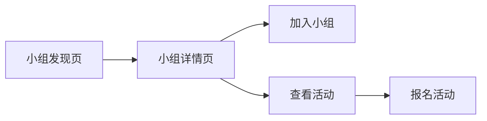

# PRD: 小红书“本地兴趣小组”功能产品需求文档

> 版本：V1.0
>
> 负责人：[Livia]
>
> 更新日期：[2025.8.26]

---

## 1. 背景与目标

### 1.1 项目背景
在项目一的分析中，我们发现小红书用户有强烈的将线上兴趣延伸到线下的需求。现有内容形态主要满足“看”和“学”，但缺少“一起玩”的场景，导致关系链和社区粘性有进一步提升空间。

### 1.2 用户痛点
*   **找不到搭子：** 想玩飞盘、陆冲，但朋友圈找不到同好。
*   **组织成本高：** 临时组局效率低，信息同步困难。
*   **信任问题：** 对陌生人组的局有安全顾虑。

### 1.3 项目目标
推出“本地兴趣小组”功能，帮助用户基于LBS和兴趣标签找到同好，将线上关系转化为线下互动，从而**提升用户留存率和社区活跃度**。

## 2. 用户故事 (User Stories)

| 角色 | 期望 | 价值 |
| :--- | :--- | :--- |
| 作为一名**滑板爱好者** | 我希望能找到周末一起在本地刷街的板友 | 满足我的社交和运动需求 |
| 作为一名**小组创建者** | 我希望能轻松地发布活动并管理成员 | 降低我的组织成本 |
| 作为一名**周末想找点事做的用户** | 我希望能方便地发现同城有趣的线下活动 | 丰富我的业余生活 |

## 3. 功能规格 (Feature Spec)

### 3.1 V1.0核心功能列表 (MVP)
*   [ ] 小组创建与资料编辑
*   [ ] 基于LBS和兴趣标签的小组发现/搜索
*   [ ] 小组成员加入/退出/管理机制
*   [ ] 组内话题发布与讨论 (类似帖子)
*   [ ] 线下活动发布与报名

### 3.2 详细功能逻辑：小组创建
1.  **入口：** “我”的页面新增“我的小组”入口。
2.  **创建流程：**
    *   填写小组名称、头像、简介。
    *   选择兴趣标签 (如 #骑行 #飞盘)。
    *   绑定地理位置 (城市/区域)。
    *   设置加入方式：公开加入 vs. 审批加入。
3.  **成功页：** 创建成功后，引导组长发布第一条欢迎贴或活动。

*(此处省略其他功能的详细逻辑...)*

## 4. 简易线框图 (Wireframes)

## 5. 成功指标 (Success Metrics)

如何衡量这个功能是否成功？

*   **核心北极星指标：** 每周参与线下活动的用户数 (WAU of offline events)。
*   **过程指标：**
    *   **活跃度：** 小组功能DAU/MAU，组内人均发帖数。
    *   **规模：** 小组总数，千人以上小组数量。
    *   **转化率：** 从浏览到加入小组的转化率，从看到活动到报名的转化率。

